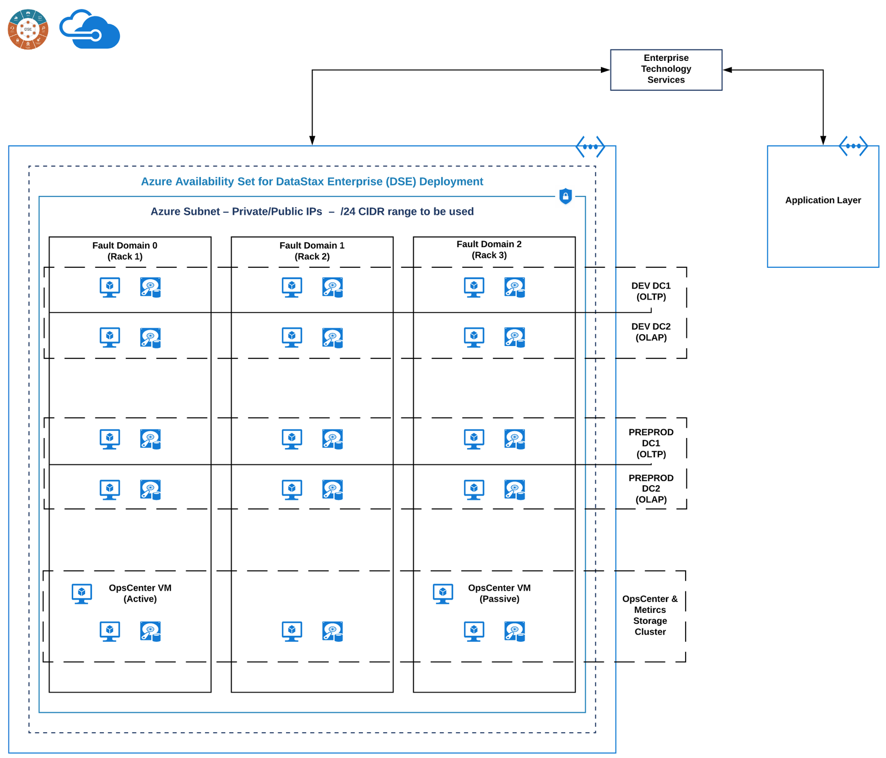

# DataStax Enterprise (DSE) on Azure Deployment Configuration Example
**_NOTE:_** This page will depict an example Azure Deployment configuration.

* Other Similar References of Interest
  * [Azure Deployment Guide](https://github.com/DSPN/azure-deployment-guide/blob/master/bestpractices.md)
  * [Cassandra on Azure VMs Performance Experiments](https://github.com/Azure-Samples/cassandra-on-azure-vms-performance-experiments)
  * [Google Deployment Guide](https://github.com/DSPN/google-deployment-guide/blob/master/bestpractices.md)
  * [Benchmarking Cassandra on GCP - InstaClustr](https://www.instaclustr.com/benchmarking-cassandra-on-the-google-cloud-platform-gcp/)
  * [Google to AWS comparison](https://cloud.google.com/docs/compare/aws)
  * [Azure to AWS comparison](https://docs.microsoft.com/en-us/azure/architecture/aws-professional/services)
---  